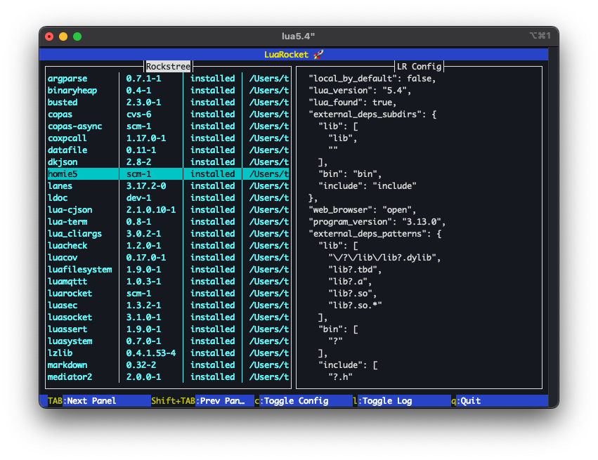
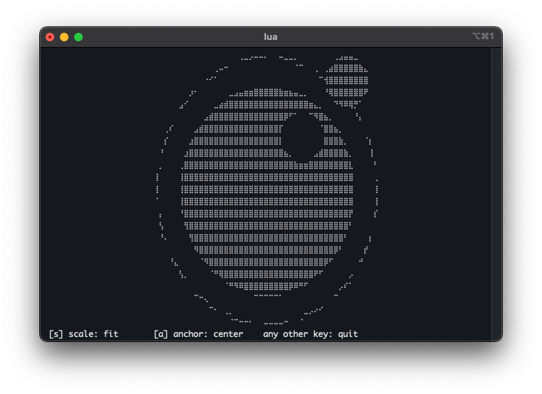

# 1. Terminal

A cross-platform terminal UI library for Lua.

## Goal

Make it easier to build functional cross-platform applications in Lua. With a focus on beginners, so that even someone just starting with Lua can build something useful. Since many beginners — often new to programming altogether — are on Windows, Windows support was essential, and hence the cross-platform focus.

## Why?

### Portability

- Cross-platform; supports *nixes, BSDs, and Windows
- No external libraries needed. It only requires [LuaSystem](https://github.com/lunarmodules/luasystem) which in turn only uses OS-provided APIs. No external libraries like curses, ncurses, or SDL are required, making it much easier to get started, especially for Windows users. A working [LuaRocks](https://luarocks.org) installation is enough.

### Mechanisms over policies

This is often cited in the Lua community as one of Lua's strengths, and this library adheres to that:

- All keyboard input is non-blocking, so it can be used in a blocking loop as well as in a yielding/coroutine-oriented loop.
- It doesn't 'steal' the main loop. It can be hooked up to a loop or into an event system, but it doesn't force that upon the user (nor does it bring its own event system or main loop implementation).
- Full UTF-8 support (also on Windows). It supports emojis, single/double/ambiguous-width characters, etc.

## Why now?

In 2019 the Windows Terminal application was first introduced in Windows 10 (not to be mistaken for `cmd.exe`). It natively supports the terminal sequences common on other platforms. That was the enabler for a cross-platform library, though it still turned out to be far harder than initially expected.
By the time the first version of this library was released in 2026, Windows 10 had become obsolete and all Windows 11 users had access to the Terminal application. Its use is widespread enough to give us a common ground.

## Structure

A working cross-platform terminal library spans from very low-level OS calls all the way to high-level functionality like windows and dialog boxes. This library implements this in 2 distinct layers:

1. [LuaSystem](https://github.com/lunarmodules/luasystem) (an external dependency) implements all the low-level OS calls needed to interact with the terminal setup. This includes terminal initialization, stream configuration, non-blocking input and keyboard handling, canonical mode, etc.
2. On top of this sit the generic functions for terminal/ANSI sequences for things like colors, cursor positioning, scroll regions, etc. These are provided by the terminal library.

These 2 layers enable cross-platform terminal interactions. For details see the [Terminal](02-terminal.md.html) topic.

Now on top of those, there are 2 sub-systems:

### CLI widgets

Interactive widgets for command-line applications. See the [CLI widgets](04-cli_widgets.md.html) topic.

- Radio buttons (select 1)
- Check boxes (select multiple)
- Non-blocking line editor (capable of running background tasks)
- Confirmation widget for OK/Cancel, Abort/Retry/Ignore, etc.
- Progress spinners and bars

### Full-screen UI

Based on a flexible panel system with automatic layouts. See the [Full-screen UI](05-fullscreen_ui.md.html) topic.

- Screen objects (to manage resizes)
- Header panel (for a title bar)
- Footer panel and key-shortcut panels (typically used at the bottom of a screen)
- Text layout panel, supporting scrolling, word-wrapping, and selectors
- Tab-strip panel

The 2 sub-systems are complemented by several utilities usable by both:

### Canvas

A drawing canvas supporting points, lines, arcs, ellipses, and polygons; includes a time-series graph. See the [Canvas](06-canvas.md.html) topic.

### Sequences

A class that makes it easy to create reusable 'drawings' on terminal screens by storing complex sequences of text, colors, cursor positioning, etc. in a single object. Supports lambda functions for dynamic content.

### String editor

An advanced string class for modifying strings by UTF-8 character or by display column. See the [Text handling](03-text_handling.md.html) topic.
