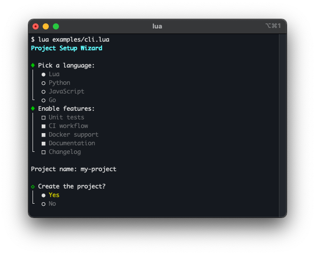

# 4. CLI widgets

CLI widgets are interactive components for command-line applications. They run inline in the terminal — no full-screen takeover needed — and handle keyboard input, rendering, and state internally. All widgets support non-blocking operation and can be integrated into a coroutine-based event loop.

## Radio buttons — `cli.Select`

`cli.Select` presents a list of options and lets the user pick exactly one. Navigation is done with arrow keys; Enter confirms the selection. The widget renders and returns the chosen value.

See the `cli.Select` class reference for the full API.

## Checkboxes — `cli.MultiSelect`

`cli.MultiSelect` presents a list of options where any number of items can be toggled. Space toggles the focused item; Enter confirms the selection and returns the set of chosen values.

See the `cli.MultiSelect` class reference for the full API.

## Line editor — `cli.Prompt`

`cli.Prompt` reads a line of input from the user with full editing support (cursor movement, delete, backspace). Because input is non-blocking, background tasks can run while the user types.

See the `cli.Prompt` class reference for the full API.

## Confirm dialog — `cli.Confirm`

`cli.Confirm` displays a configurable confirmation prompt such as OK/Cancel or Abort/Retry/Ignore. The user selects an option with arrow keys or a hotkey shortcut.

See the `cli.Confirm` class reference for the full API.

## Progress — `terminal.progress`, `progress.Bar`

`terminal.progress` provides a spinner for indeterminate tasks. `progress.Bar` renders a progress bar for tasks with a known completion percentage.

See the `terminal.progress` and `progress.Bar` class references for the full API.
