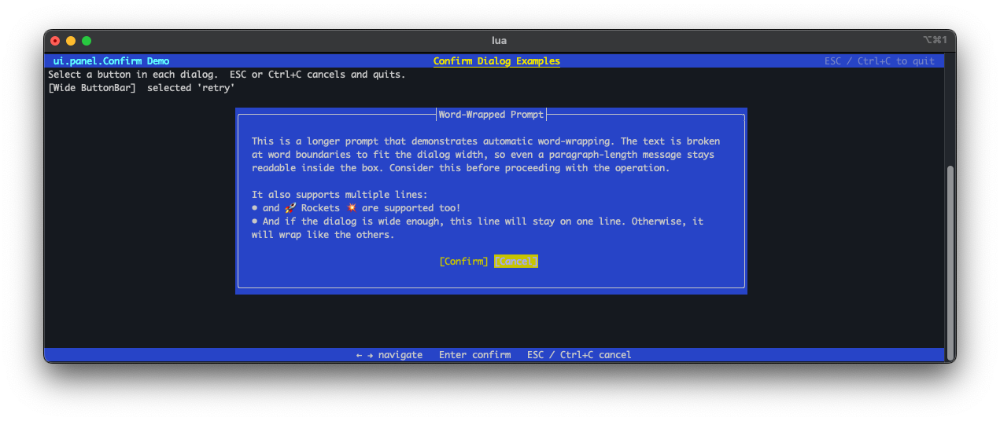
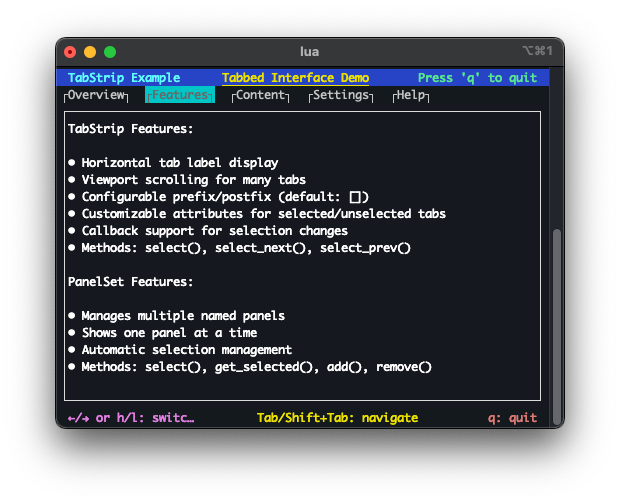

# 5. Full-screen UI

The full-screen UI system is built around a flexible panel framework. Panels are rectangular regions of the terminal that manage their own rendering and layout. The framework handles automatic sizing and positioning so individual panels don't need to track terminal dimensions manually.

## Screen — `ui.panel.Screen`

`ui.panel.Screen` is the root container for a full-screen UI. It manages terminal resize events and reflows the layout accordingly. All other panels are attached to and rendered through a Screen.

See the `ui.panel.Screen` class reference for the full API.

## Header panel — `ui.panel.Bar`

`ui.panel.bar` renders a single fixed-height row, typically used as a title bar at the top of the screen. It supports colored backgrounds and formatted text.

See the `ui.panel.Bar` class reference for the full API.

## Footer and key-shortcut panels — `ui.panel.Bar`, `ui.panel.KeyBar`

Footer panels work the same way as header panels and are typically placed at the bottom of the screen. `ui.panel.KeyBar` is a specialization that renders a row of labelled keyboard shortcuts.

See the `ui.panel.KeyBar` class reference for the full API.

## Dialogs — `ui.panel.Confirm`

`ui.panel.Confirm` displays confirmation prompts. Prompt text can be multi-line with automatic word-wrapping.

See the `ui.panel.Confirm` class reference for the full API.

## Text layout panel — `ui.panel.Text`

`ui.panel.Text` displays scrollable, word-wrapped text content. It supports selectors for navigating and highlighting lines or regions within the panel.

See the `ui.panel.Text` class reference for the full API.

## Tab-strip panel — `ui.panel.TabStrip`

`ui.panel.TabStrip` renders a horizontal row of tabs. Selecting a tab can drive which content panel is shown, providing a familiar tabbed-interface pattern.

See the `ui.panel.TabStrip` class reference for the full API.

